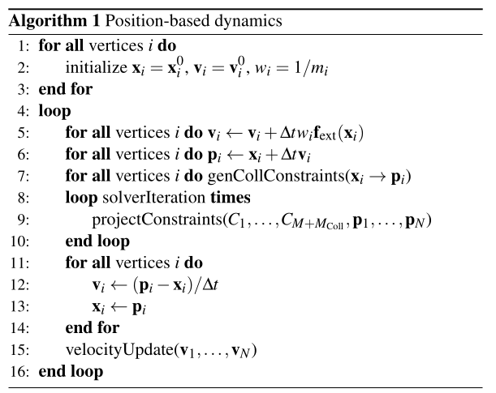
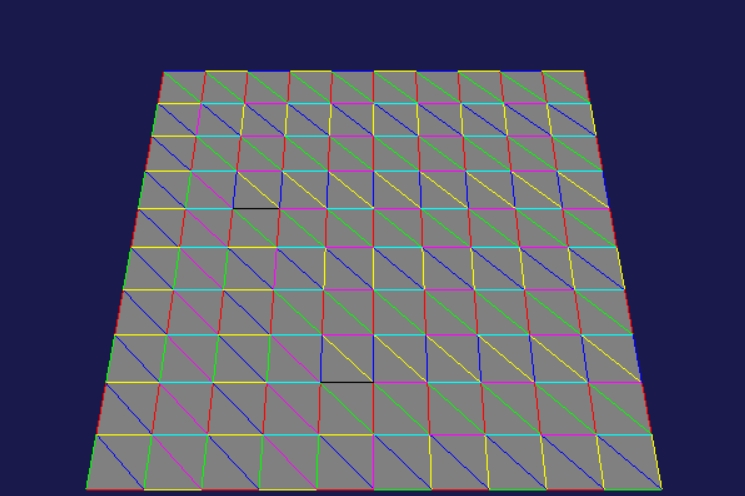

# cloth-pbd
Simple position-based-dynamic(PBD) cloth model.

## Algorithm
I follow the basic PBD algorithm <a href="#ref-1">[1]</a>.

Corner vertices are immobile and one middle vertex is moved externally, 
so they are supposed to have infinite masses $m_i = \infty, w_i = 1/m_i = 0$.
        
## Constraints

For a distance constraint between adjacent vertices 
$C(\mathbf x_1,\mathbf x_2) = |\mathbf x_1 - \mathbf x_2| - d = 0$ corrections are as follows
$$\Delta \mathbf x_1 = -\frac{k\cdot w_1}{w_1 + w_2}C(\mathbf x_1,\mathbf x_2)\mathbf n,$$
$$\Delta \mathbf x_2 = \frac{k\cdot w_2}{w_1 + w_2}C(\mathbf x_1,\mathbf x_2)\mathbf n,$$
where $d$ - initial distance, $w_i = 1/m_i$ - inverse masses, $k\in(0,1]$ - stretching factor, 
$\mathbf n = (\mathbf x_1 - \mathbf x_2)/|\mathbf x_1 - \mathbf x_2|$ - unit vertor pointing from second to first particle.

## Parallel projections

In order to perform corrections of coordinates on GPU we need to divide 
mesh edges into several groups with no adjacent edges. In this case different gpu processes would not change the same. 
This is performed via coloring the edges according to greedy algorithm <a href="#ref-2">[2]</a>.
The maximum number of colors is $6 + 1=7$ as the maximimum vertex degree is $6$.

    

<h3>References</h3>
    <ol>
        <li id="ref-1">
            Jan Bender, Matthias Müller, and Miles Macklin. 2017. A survey on position based dynamics, 2017. 
            In Proceedings of the European Association for Computer Graphics: Tutorials. 1–31.
        </li>
        <li id="ref-2">
            P. Yu, Z. Zhao, R. Wang, J. Pan, Real-time soft body dissection simulation with parallelized graph-based shape matching on gpu, 
            Comput. Methods Programs Biomed. 250 (2024),.
        </li>
    </ol>

